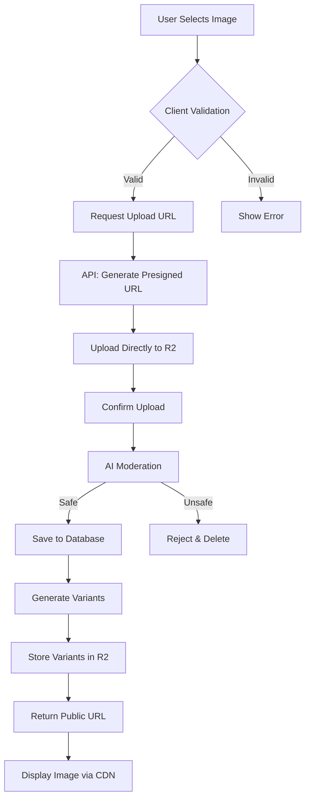

# Image Upload System - Executive Summary

## What You're Building

A **production-ready, scalable image upload system** that handles all image needs across your Chapturs platform:

- 📸 **Profile Pictures** - User avatars and cover images
- 📚 **Book Covers** - Work/novel cover images
- 🎨 **Fan Art** - User-submitted artwork
- 🖼️ **Chapter Illustrations** - Embedded chapter images
- 👥 **Character References** - Character profile images
- 💬 **Community Content** - Comments, posts, etc.

## Why This Approach?

### Traditional Approach (What NOT to Do)
```
User → Server → Process → Store → CDN → User
      (slow)   (expensive)(slow)
```
**Problems**:
- Server bandwidth costs
- Server processing time
- Slow for users
- Doesn't scale

### Our Approach (What We're Building)
```
User → Presigned URL → R2 (instant storage + CDN) → User
      (free)           (fast, cheap)
```
**Benefits**:
- Zero server bandwidth
- Instant uploads
- Automatic CDN
- Scales infinitely

## Key Technology Choices

### 1. Cloudflare R2 (Storage + CDN)
**Why?**
- ✅ **$0 egress fees** - Save thousands on bandwidth
- ✅ **Global CDN included** - Fast worldwide
- ✅ **S3-compatible** - Easy to use, easy to migrate
- ✅ **Simple pricing** - Predictable costs

**Cost**: ~$2-5/month for 100GB + millions of views  
**Alternative (AWS S3)**: ~$50-100/month for same usage

### 2. Presigned URLs (Security)
**Why?**
- ✅ Users upload directly to R2 (not through your server)
- ✅ Time-limited access (URLs expire)
- ✅ No server load
- ✅ Faster uploads

**How it works**:
1. User requests upload permission from your API
2. API generates temporary upload URL (expires in 1 hour)
3. User uploads directly to R2 using that URL
4. User confirms upload with your API
5. API saves metadata to database

### 3. Sharp (Image Processing)
**Why?**
- ✅ Create multiple sizes (thumbnail, medium, large)
- ✅ Convert to WebP (30-50% smaller files)
- ✅ Fast processing
- ✅ Maintain aspect ratios

**Result**: Faster page loads, better UX

### 4. Claude Vision API (Content Moderation)
**Why?**
- ✅ Automatic NSFW detection
- ✅ Block inappropriate content
- ✅ Protect your community
- ✅ Reduce manual moderation

**Cost**: ~$0.001 per image check

## Architecture Overview



## Implementation Plan

### Week 1: Core System
**Days 1-2**: Setup & Infrastructure
- Set up Cloudflare R2 account
- Create bucket and API tokens
- Install dependencies
- Create database schema

**Days 3-4**: API Development
- Build presigned URL endpoint
- Build confirmation endpoint
- Add authentication & validation
- Test with Postman

**Days 5-7**: UI Component
- Create ImageUpload component
- Add upload progress
- Add preview functionality
- Style and polish

### Week 2: Integration & Polish
**Days 1-2**: Integration
- Add to profile editor
- Add to book cover upload
- Add to fan art system

**Days 3-4**: Advanced Features
- Image optimization/variants
- Content moderation
- Rate limiting

**Days 5-7**: Testing & Deploy
- Comprehensive testing
- Fix bugs
- Deploy to production
- Monitor and optimize

## File Structure

```
src/
├── lib/
│   ├── r2.ts                    # R2 client & helpers
│   ├── image-processing.ts      # Sharp optimization
│   ├── upload-validation.ts     # File validation
│   └── image-moderation.ts      # AI moderation
│
├── app/api/upload/
│   ├── request/route.ts         # Generate presigned URL
│   ├── confirm/route.ts         # Save metadata
│   └── delete/route.ts          # Delete images
│
├── components/
│   └── ImageUpload.tsx          # Reusable upload component
│
└── app/
    ├── creator/profile/edit/    # Uses ImageUpload
    ├── creator/works/[id]/edit/ # Uses ImageUpload
    └── fanart/submit/           # Uses ImageUpload

prisma/schema.prisma             # Add Image model
.env.local                       # R2 credentials
```

## Code You'll Write

### 1. R2 Client (30 lines)
```typescript
// src/lib/r2.ts
import { S3Client } from '@aws-sdk/client-s3'

const r2Client = new S3Client({
  region: 'auto',
  endpoint: `https://${process.env.R2_ACCOUNT_ID}.r2.cloudflarestorage.com`,
  credentials: {
    accessKeyId: process.env.R2_ACCESS_KEY_ID!,
    secretAccessKey: process.env.R2_SECRET_ACCESS_KEY!,
  },
})

export async function generatePresignedUploadUrl(key: string, contentType: string) {
  // Generate presigned URL
}

export function getPublicUrl(key: string) {
  return `${process.env.R2_PUBLIC_URL}/${key}`
}
```

### 2. Upload Request API (50 lines)
```typescript
// src/app/api/upload/request/route.ts
export async function POST(request: NextRequest) {
  // 1. Authenticate user
  // 2. Validate request
  // 3. Generate unique filename
  // 4. Create presigned URL
  // 5. Return URL + metadata
}
```

### 3. Upload Confirm API (60 lines)
```typescript
// src/app/api/upload/confirm/route.ts
export async function POST(request: NextRequest) {
  // 1. Authenticate user
  // 2. Save image metadata to database
  // 3. Run AI moderation (optional)
  // 4. Generate variants (optional)
  // 5. Return public URL
}
```

### 4. Upload Component (150 lines)
```typescript
// src/components/ImageUpload.tsx
export default function ImageUpload(props) {
  // 1. File selection
  // 2. Client validation
  // 3. Preview generation
  // 4. Upload flow (request → upload → confirm)
  // 5. Progress tracking
  // 6. Error handling
}
```

**Total**: ~300-400 lines of code for entire system!

## Usage Examples

### Profile Picture
```tsx
<ImageUpload
  value={profileImage}
  onChange={(url) => setProfileImage(url)}
  entityType="profile"
  aspectRatio="1/1"
  maxSize={5}
  label="Profile Picture"
/>
```

### Book Cover
```tsx
<ImageUpload
  value={coverImage}
  onChange={(url) => setCoverImage(url)}
  entityType="work_cover"
  aspectRatio="2/3"
  maxSize={10}
  label="Book Cover"
/>
```

### Fan Art Gallery
```tsx
{fanArtImages.map((img, i) => (
  <ImageUpload
    key={i}
    value={img}
    onChange={(url) => updateImage(i, url)}
    onDelete={() => removeImage(i)}
    entityType="fanart"
    aspectRatio="auto"
    maxSize={15}
  />
))}
```

## Security Features

✅ **Authentication** - Only logged-in users can upload  
✅ **File Validation** - Size, type, extension checks  
✅ **Rate Limiting** - Prevent abuse (10 uploads/hour)  
✅ **Presigned URLs** - Time-limited access (1 hour)  
✅ **Content Moderation** - AI checks for inappropriate content  
✅ **Ownership** - Users can only delete their own images  
✅ **Audit Logging** - Track all upload activity  

## Performance Features

✅ **Direct Upload** - Bypass server, upload to R2 directly  
✅ **Global CDN** - Fast delivery worldwide  
✅ **Image Variants** - Multiple sizes for responsive design  
✅ **WebP Format** - 30-50% smaller than JPEG  
✅ **Lazy Loading** - Load images as needed  
✅ **Caching** - Browser and CDN caching  

## Cost Breakdown

### Your System (Cloudflare R2)
```
Monthly for 200GB storage + 50K uploads + 5M views:

Storage:   200GB × $0.015 = $3.00
Uploads:   50K × $4.50/1M = $0.23
Views:     5M × $0.36/1M  = $1.80
Bandwidth: UNLIMITED      = $0.00 ⭐

TOTAL: $5.03/month
```

### Alternative (AWS S3 + CloudFront)
```
Monthly for same usage:

Storage:   200GB × $0.023 = $4.60
Uploads:   50K × $5/1M    = $0.25
Views:     5M × $0.40/1M  = $2.00
Bandwidth: 500GB × $0.08  = $40.00 ⚠️

TOTAL: $46.85/month
```

**Savings: $500/year or 89% cheaper!** 💰

## What You Get

### For Users
- ✅ Fast image uploads
- ✅ Real-time progress bars
- ✅ Instant previews
- ✅ Global fast loading (CDN)
- ✅ Mobile-friendly
- ✅ Responsive images

### For You (Developer)
- ✅ Simple API (3 endpoints)
- ✅ Reusable component
- ✅ Secure by default
- ✅ Scales automatically
- ✅ Minimal maintenance
- ✅ Comprehensive docs

### For Your Platform
- ✅ Professional image handling
- ✅ Content moderation
- ✅ Cost-effective at scale
- ✅ Fast global delivery
- ✅ SEO-friendly images
- ✅ Mobile optimized

## Next Steps

1. **Read**: `IMAGE_UPLOAD_IMPLEMENTATION.md` (full guide)
2. **Follow**: `IMAGE_UPLOAD_CHECKLIST.md` (step-by-step)
3. **Reference**: `IMAGE_UPLOAD_ARCHITECTURE.md` (technical details)
4. **Start**: Phase 1 - Cloudflare R2 setup

## Common Questions

**Q: Why not upload to my Next.js server?**  
A: Your server would handle all upload bandwidth = expensive & slow. R2 direct uploads are free & fast.

**Q: What if R2 goes down?**  
A: Cloudflare has 99.9% uptime SLA. Plus, it's S3-compatible so you can migrate easily.

**Q: Do I need image variants?**  
A: Optional but recommended. Smaller images = faster page loads = better UX.

**Q: How do I moderate images?**  
A: Use Claude Vision API (included in guide) or manual review queue.

**Q: Can I use this for other file types?**  
A: Yes! The same approach works for PDFs, documents, etc. Just adjust validation.

**Q: What about NSFW content?**  
A: AI moderation (Claude) flags inappropriate content automatically.

## Success Criteria

After implementation, you should have:

✅ Users can upload images < 10MB  
✅ Upload progress is visible  
✅ Images stored in R2 bucket  
✅ Images load from global CDN  
✅ Multiple image sizes generated  
✅ Inappropriate content blocked  
✅ Rate limiting prevents abuse  
✅ Delete functionality works  
✅ Mobile-friendly upload experience  
✅ No TypeScript errors  

## Maintenance Required

**Weekly**: Monitor upload success rates  
**Monthly**: Review storage costs & usage  
**Quarterly**: Update dependencies  
**Yearly**: Review and optimize performance  

**Total time**: ~2 hours/month

## Future Enhancements

Once basic system is live, you can add:

- [ ] Drag-and-drop upload
- [ ] Image cropping tool
- [ ] Bulk upload (multiple files)
- [ ] Upload from URL
- [ ] Image gallery/lightbox
- [ ] EXIF data preservation
- [ ] Watermarking
- [ ] Advanced compression
- [ ] Video upload (same approach)

## Conclusion

This system gives you **enterprise-grade image handling** at a **fraction of the cost** of traditional solutions. It's:

- **Fast** - Direct uploads, global CDN
- **Cheap** - Zero egress fees saves hundreds/month
- **Secure** - Multiple validation layers
- **Scalable** - Handles millions of images
- **Simple** - Reusable component, clean API

**Investment**: 1 week of development  
**Return**: Professional image system for years  
**Cost**: ~$5/month (vs $50+ for alternatives)  

Ready to build? Start with the implementation guide! 🚀

---

**Documentation Files**:
1. `IMAGE_UPLOAD_IMPLEMENTATION.md` - Complete technical guide
2. `IMAGE_UPLOAD_CHECKLIST.md` - Step-by-step checklist
3. `IMAGE_UPLOAD_ARCHITECTURE.md` - System architecture
4. `IMAGE_UPLOAD_SUMMARY.md` - This document

**Estimated Timeline**: 1 week for complete implementation  
**Difficulty**: Intermediate (well-documented)  
**Value**: Extremely high (platform-critical feature)
